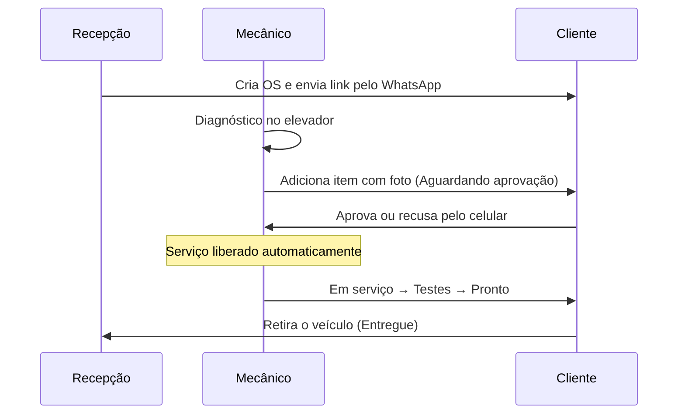
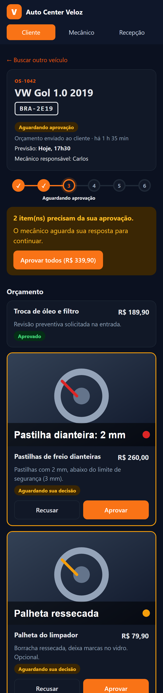
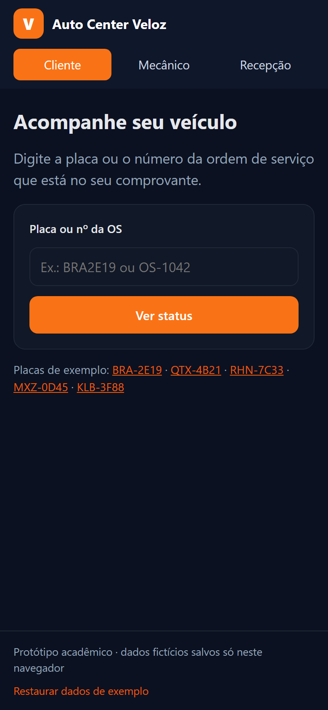
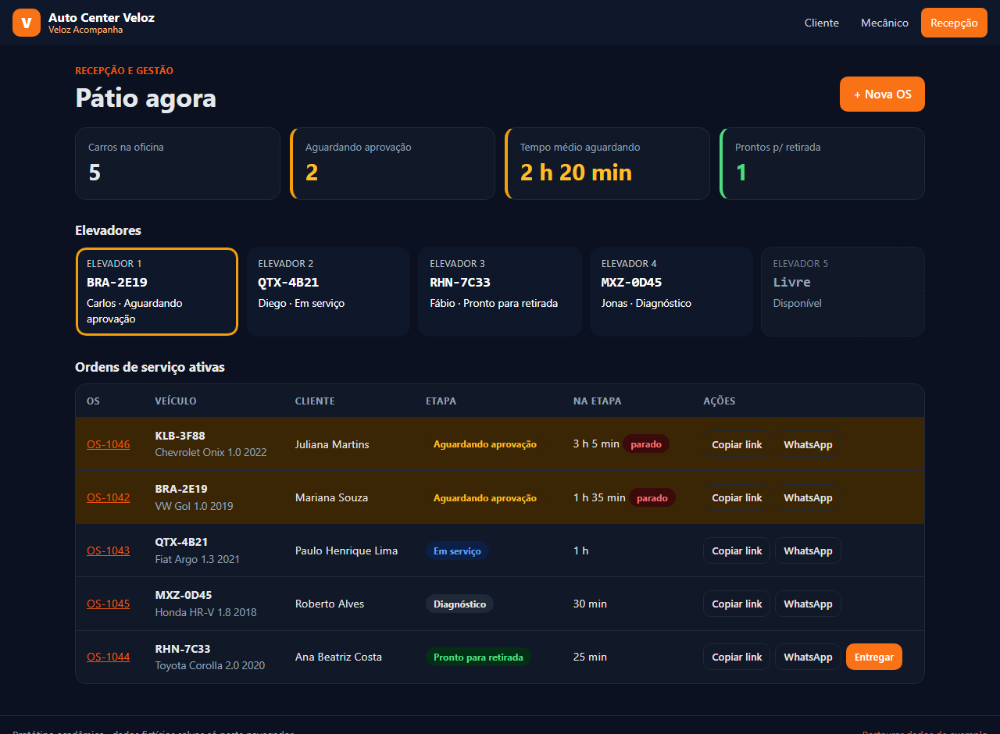
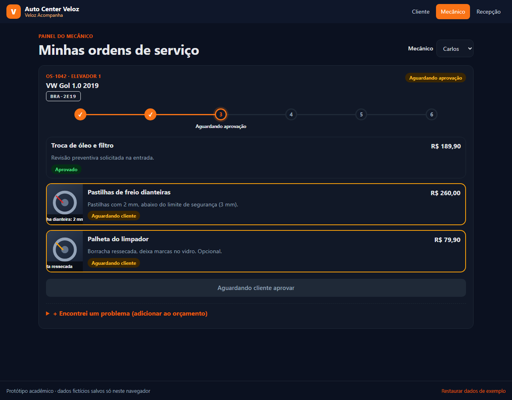
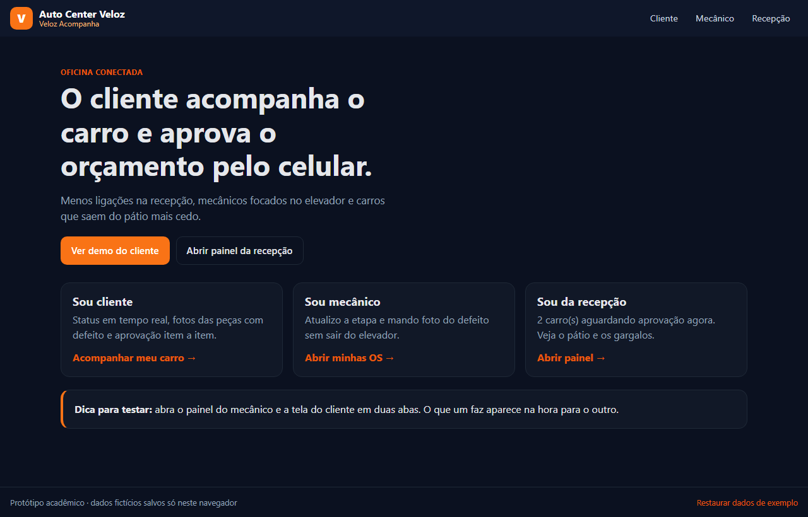

# Auto Center Veloz · Veloz Acompanha

> Web app para o cliente da oficina **acompanhar o conserto e aprovar o orçamento pelo celular**, com fotos das peças, enquanto mecânicos e recepção atualizam tudo em um só lugar.

**Demo online:** https://SEU-USUARIO.github.io/autocenter-veloz/

Atividade avaliativa (Estudo de Caso 3) da disciplina **Design Profissional: Produção de Portfólio & Desenvolvimento Empresarial**, com o Prof. Sedenilso Antonio Machado.
Autor: **Ricardo Medeiros**.

---

## Sumário

1. [Briefing do problema](#1-briefing-do-problema)
2. [Decisão de design: por que um web app](#2-decisão-de-design-por-que-um-web-app)
3. [A solução](#3-a-solução)
4. [Protótipo e telas](#4-protótipo-e-telas)
5. [Arquitetura](#5-arquitetura)
6. [Como executar](#6-como-executar)
7. [Segurança e credenciais](#7-segurança-e-credenciais)
8. [Próximos passos](#8-próximos-passos)
9. [Licença](#9-licença)

---

## 1. Briefing do problema

**Cliente:** Auto Center Veloz, oficina de manutenção preventiva e corretiva de carros de passeio, dos sócios Eduardo (gerente de oficina) e Henrique (financeiro e compras). A oficina tem 5 elevadores, 6 mecânicos e 2 recepcionistas, e uma ótima reputação técnica.

**Como funciona hoje:** a recepção cadastra o veículo e imprime o orçamento. Quando o mecânico encontra uma peça a mais para trocar, a recepção liga ou manda mensagem ao cliente pedindo autorização.

**A dor:**

| Sintoma | Consequência |
|---|---|
| Telefone da recepção não para: "o carro já está pronto?", "manda foto da peça?" | Recepção sobrecarregada e atendimento lento |
| Mecânicos param o serviço para responder à recepção | Menos produtividade nos elevadores |
| Cliente demora horas para aprovar o orçamento por mensagem | Carro parado, elevador ou pátio ocupado |
| Pátio lotado de carros aguardando resposta | Menos carros atendidos por dia |
| Falha de comunicação | Risco de avaliações negativas na internet |

**A oportunidade:** as concessionárias já entregam relatório digital, mas cobram caro; as oficinas informais não entregam nada. A Veloz pode juntar a confiança técnica que já tem com **transparência e rapidez digital**, reduzindo o tempo que cada veículo passa no pátio.

**Objetivo do produto:** reduzir o tempo entre "orçamento enviado" e "orçamento aprovado" e acabar com as ligações de status.

## 2. Decisão de design: por que um web app

Avaliei as três opções da atividade:

| Critério | App móvel nativo | Site institucional | **Web app responsivo (escolhido)** |
|---|---|---|---|
| Cliente precisa instalar algo? | Sim, e ninguém instala app de oficina para usar 2 vezes por ano | Não | **Não: abre por um link no WhatsApp** |
| Resolve status e aprovação? | Sim | Não, só apresenta a empresa | **Sim** |
| Mecânico usa no celular, com câmera? | Sim | Não | **Sim (`<input capture>`)** |
| Recepção tem painel de gestão? | Exigiria outro sistema | Não | **Sim, no mesmo produto** |
| Custo e prazo para a oficina | Alto (lojas, duas plataformas) | Baixo | **Baixo (hospedagem estática)** |

**Conclusão:** o problema é de **comunicação durante o serviço**, e não de divulgação. Por isso um site institucional não resolve. Um app nativo cria uma barreira, que é instalar. O **web app** chega ao cliente por um link enviado no WhatsApp, funciona em qualquer celular e, no mesmo produto, entrega as telas do mecânico e da recepção.

### Princípios de design adotados

- **Mobile-first:** o cliente e o mecânico usam o celular. Botões com no mínimo 44 px e ações principais sempre visíveis.
- **Uma decisão por vez:** cada item do orçamento tem foto, explicação em linguagem simples, preço e dois botões (Aprovar ou Recusar). Também há "Aprovar todos".
- **Transparência gera confiança:** a foto da peça com defeito e o motivo da troca ficam ao lado do preço.
- **Status sempre visível:** uma linha do tempo em 6 etapas responde "como está meu carro?" sem ligação.
- **Gargalo à vista:** a recepção vê em destaque os carros parados há mais de 60 min aguardando aprovação.
- **Acessibilidade:** contraste adequado, foco visível, `aria-current` na etapa atual, `aria-live` nas notificações, tema escuro automático e respeito a `prefers-reduced-motion`.

## 3. A solução

O **Veloz Acompanha** tem três perfis, todos no mesmo web app:

### Cliente
- Encontra o carro pela **placa ou nº da OS**, ou abre direto pelo **link recebido no WhatsApp**.
- Vê a **etapa atual**, a previsão de entrega e o mecânico responsável.
- Vê a **foto e a explicação** de cada peça com defeito e **aprova ou recusa item a item**.
- Quando responde todos os itens, o serviço é **liberado automaticamente** para o mecânico, sem passar pela recepção.

### Mecânico
- Vê só as **suas OS**, com o elevador de cada uma.
- **Avança a etapa** com um toque, e o cliente é atualizado na hora.
- Em "Encontrei um problema", **fotografa a peça pelo celular**, informa valor e explicação, e envia para aprovação.
- O botão de avançar fica travado enquanto há itens aguardando o cliente, o que evita trabalho não autorizado.

### Recepção e gestão (Eduardo e Henrique)
- **Indicadores:** carros na oficina, aguardando aprovação, tempo médio de espera e prontos para retirada.
- **Mapa dos 5 elevadores:** livre ou ocupado, com alerta quando o carro está parado.
- **Lista de OS** ordenada por urgência, com **copiar link** e **enviar pelo WhatsApp** (mensagem pronta).
- **Nova OS:** cadastro na entrada do veículo, que já gera o link do cliente.

### Fluxo principal



## 4. Protótipo e telas

O protótipo é **navegável e funcional**: acesse a [demo online](https://SEU-USUARIO.github.io/autocenter-veloz/).

> Dica: abra a tela do **mecânico** e a do **cliente** em duas abas. Quando o cliente aprova, a outra aba atualiza sozinha.

| Cliente (celular): status e aprovação | Cliente (celular): busca |
|---|---|
|  |  |

**Recepção: painel do pátio**



**Mecânico: minhas OS**



**Página inicial**



## 5. Arquitetura

Protótipo **100% front-end e estático**, sem build e sem dependências externas, pronto para o GitHub Pages.

```
autocenter-veloz/
├── index.html            # Estrutura da página (topo, área do app, rodapé)
├── css/
│   └── styles.css        # Design system: tokens de cor, componentes, responsivo, tema escuro
├── js/
│   ├── data.js           # Etapas do serviço, mecânicos, elevadores e dados de exemplo
│   └── app.js            # SPA: roteamento por hash, telas, ações e persistência
├── docs/screenshots/     # Capturas usadas neste README
├── .gitignore
├── LICENSE
└── README.md
```

| Camada | Decisão |
|---|---|
| Interface | HTML5 semântico + CSS3 (Grid, Flexbox, custom properties), sem framework |
| Lógica | JavaScript puro (ES5+), em uma *single page application* com rotas `#/cliente`, `#/cliente/OS-1042`, `#/mecanico` e `#/recepcao` |
| Estado | Objeto `orders` persistido no `localStorage`. O evento `storage` sincroniza abas abertas em tempo real |
| Fotos | Capturadas pela câmera (`capture="environment"`), redimensionadas no `<canvas>` para 640 px em JPEG antes de salvar |
| Segurança | Todo texto digitado é escapado antes de ir para o HTML (proteção contra XSS) |
| Hospedagem | GitHub Pages (estático, HTTPS, gratuito) |

**Modelo de dados (uma OS):**

```json
{
  "id": "OS-1042", "placa": "BRA2E19", "modelo": "VW Gol 1.0 2019",
  "cliente": "Mariana Souza", "telefone": "41999990001",
  "mecanico": "Carlos", "elevador": 1, "step": 2, "previsao": "Hoje, 17h30",
  "itens": [{ "desc": "Pastilhas de freio", "valor": 260, "status": "pendente", "obs": "...", "foto": "data:image/..." }],
  "timeline": [{ "t": 1759700000000, "msg": "Orçamento enviado para aprovação" }]
}
```

**Arquitetura de produção (evolução proposta):** trocar o `localStorage` por uma API (por exemplo Node.js + PostgreSQL, ou um BaaS como Supabase/Firebase), guardar as fotos em armazenamento de objetos, autenticar a equipe e enviar notificações automáticas pela API oficial do WhatsApp Business. O front-end já está separado por perfis e ações, então só a camada de persistência muda.

## 6. Como executar

**Online:** acesse https://SEU-USUARIO.github.io/autocenter-veloz/

**Localmente** (não precisa instalar dependências):

```bash
git clone https://github.com/SEU-USUARIO/autocenter-veloz.git
cd autocenter-veloz

# opção 1: abrir direto no navegador
start index.html        # Windows  (macOS: open index.html | Linux: xdg-open index.html)

# opção 2: servidor local (recomendado)
python -m http.server 8080
# acesse http://localhost:8080
```

**Roteiro de teste (2 minutos):**

1. Em **Recepção**, veja os 2 carros parados aguardando aprovação.
2. Abra **Cliente** e escolha `BRA-2E19`. Veja as fotos e aprove as pastilhas de freio e recuse a palheta.
3. Veja que a OS passou sozinha para **Em serviço**.
4. Em **Mecânico** (Carlos), avance as etapas até **Pronto para retirada**.
5. Volte à **Recepção** e clique em **Entregar**. Use **+ Nova OS** para cadastrar um carro novo.
6. Para recomeçar, use **Restaurar dados de exemplo** no rodapé.

## 7. Segurança e credenciais

- O projeto **não usa nenhuma credencial, senha, token ou chave de API**, nem no código nem no histórico de commits.
- O envio pelo WhatsApp usa o link público `wa.me`, que não precisa de chave.
- O `.gitignore` já bloqueia `.env`, `*.pem`, `*.key` e `secrets.*`, para quando o projeto evoluir para um back-end.
- Todos os nomes, placas e telefones são **fictícios**.

## 8. Próximos passos

- Back-end com autenticação da equipe e link do cliente com token de acesso único.
- Notificação automática pelo WhatsApp Business a cada mudança de etapa.
- Pagamento por Pix na retirada e avaliação pós-serviço (para melhorar a reputação no Google).
- Relatórios para o Henrique: tempo médio por etapa, taxa de aprovação e faturamento por mecânico.

## 9. Licença

Distribuído sob a licença MIT. Veja [LICENSE](LICENSE).

© 2026 Ricardo Medeiros
